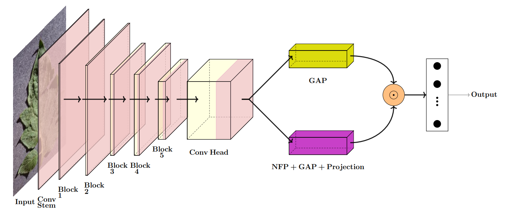

# Neighbour Feature Pooling (NFP)  
**Texture-Aware Pooling for Remote Sensing**  

*By Fahimeh Orvati Nia, Amirmohammad Mohammadi, Salim Al Kharsa, Pragati Naikare, Zigfried Hampel-Arias, and Joshua Peeples*  

---

## Overview  
Neighbour Feature Pooling (NFP) is a novel pooling mechanism that captures local neighborhood similarity for improved **texture-aware classification** in remote sensing and agricultural image datasets.  
This repository provides the PyTorch Lightning implementation for training and evaluating **ResNet18, MobileNetV3, and ViT-Tiny backbones** with GAP, NFP, fractal, lacunarity, RADAM, and DeepTEN pooling modules.  

<p align="center">
  
</p>  

---

## Datasets Supported  
- **UCMerced Land Use** (21 classes)  
- **RESISC45** (45 classes)  
- **GTOS-Mobile** (31 classes)  
- **PlantVillage** (15–38 classes)  
- **EuroSAT** (10 classes, 13 spectral bands)  

---

## Installation  

```bash
# clone the repo
git clone https://github.com/Advanced-Vision-and-Learning-Lab/Neighbour_Feature_Pooling.git
cd Neighbour_Feature_Pooling_Clean

# create environment
module purge
module load GCC/13.3.0
module load Python/3.12.3
python -m venv myenv
source myenv/bin/activate

# install requirements
pip install -r requirements.txt
```

---

## Training Demo  

Example: train **ResNet18 (GAP only) on EuroSAT**  

```bash
EXPERIMENT_NAME="gap_only-resnet18-eurosat"
DATASET="EuroSAT"
DATA_DIR="data/EuroSAT"

mkdir -p logs/${EXPERIMENT_NAME}

python demo.py \
    --name ${EXPERIMENT_NAME} \
    --dataset ${DATASET} \
    --data_dir ${DATA_DIR} \
    --model_type resnet18 \
    --model_variant gap_only
```

---

## Example Results  

| Model        | Dataset     | Pooling          | Accuracy (%) |
|--------------|-------------|------------------|--------------|
| ResNet18     | UCMerced    | GAP              | 87.1         |
| ResNet18     | UCMerced    | **NFP (cosine)** | **91.5**     |
| MobileNetV3  | GTOS-Mobile | RADAM            | 78.3         |
| ViT-Tiny     | PlantVillage| Lacunarity       | 95.0         |

---

## Repository Structure  

```text
Neighbour_Feature_Pooling/
├── demo.py                    # Main training script - orchestrates experiments with different models and datasets
├── DataModules.py             # PyTorch Lightning DataModules for all supported datasets (UCMerced, RESISC45, GTOS-Mobile, PlantVillage, EuroSAT)
├── models/                    # Neural network architectures and pooling modules
│   ├── __init__.py           # Package initialization
│   ├── resnet18.py           # ResNet18 variants with GAP/NFP/MLP fusion heads
│   ├── mobilenetv3.py        # MobileNetV3 variants with various pooling strategies
│   ├── vittiny.py            # Vision Transformer Tiny implementations
│   ├── vittiny_models_new.py # Enhanced ViT-Tiny models with NFP integration
│   ├── NFP_Pooling.py        # Core Neighbour Feature Pooling implementation
│   ├── nfp_heads.py          # NFP head modules for different architectures
│   ├── Fractal_Pooling.py    # Fractal dimension-based pooling module
│   ├── Lacunarity_Pooling.py # Lacunarity-based texture pooling
│   ├── radam_pooling.py      # RADAM (Random Adaptive Max) pooling
│   ├── deepten.py            # DeepTEN texture analysis pooling
│   ├── texture_pooling.py    # General texture-aware pooling utilities
│   ├── RNN.py                # Recurrent neural network components
│   └── pooling/              # Core pooling implementations
│       └── nfp.py            # Main NFP algorithm with cosine similarity measures
├── lightning_wrappers/        # PyTorch Lightning integration
│   └── Lightning_Wrapper.py # Training/evaluation wrapper with metrics, logging, and callbacks
├── requirements.txt          # Python dependencies (PyTorch, Lightning, geospatial libs, etc.)
├── run_nfp_experiments_new.slurm # SLURM batch script for HPC cluster execution
├── RAE_LCG_weights.pkl      # Pre-trained weights for RAE-LCG texture features
├── nfp_overview.png         # Architecture overview diagram
└── README.md                # This documentation file
```

### Key Components Explained

**Core Files:**
- `demo.py`: Main entry point that handles command-line arguments, model instantiation, and training orchestration
- `DataModules.py`: Contains PyTorch Lightning DataModules for all 5 supported datasets with proper data loading, augmentation, and preprocessing

**Models Directory:**
- **Architecture Files**: `resnet18.py`, `mobilenetv3.py`, `vittiny.py` contain backbone networks with various pooling head configurations
- **Pooling Modules**: Multiple texture-aware pooling implementations including the novel NFP, fractal, lacunarity, RADAM, and DeepTEN
- **NFP Implementation**: `pooling/nfp.py` contains the core Neighbour Feature Pooling algorithm using cosine similarity measures

**Lightning Integration:**
- `Lightning_Wrapper.py`: Handles training loops, validation, metrics computation, confusion matrices, and experiment logging

**Dependencies:**
- Core ML: PyTorch, PyTorch Lightning, timm, torchmetrics
- Geospatial: torchgeo, rasterio for remote sensing datasets
- Visualization: matplotlib, seaborn, tensorboard
- Data augmentation: albumentations, kornia

---

## License  
This project is licensed under the **MIT License**. See the [LICENSE](LICENSE) file for details.  

---

## Citation  

If you use this repository in your research, please cite:  

```bibtex
@article{orvatinia2025nfp,
  title={Neighborhood Feature Pooling for Remote Sensing Image Classification},
  author={Orvati Nia, Fahimeh and Mohammadi, Amirmohammad and Al Kharsa, Salim and Naikare, Pragati and Hampel-Arias, Zigfried and Peeples, Joshua},
  journal={arXiv preprint arXiv:2510.xxxxx},
  year={2025},
  url={https://github.com/Advanced-Vision-and-Learning-Lab/Neighbour_Feature_Pooling}
}

